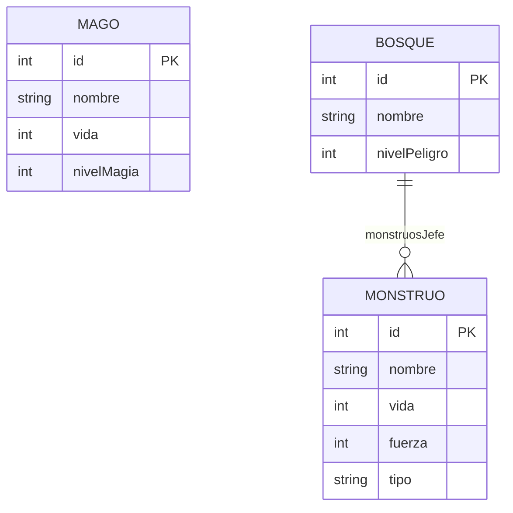

# Documentación del modelo de datos

## Introduccion

## Analisis

### Diagrama de clases

```mermaid
classDiagram
    class Bosque{
      -int id
      -String nombre
      -int nivelPeligro
      +mostrarMonstruo()
      +añadirMonstruo(Monstruo monstruo)
      +eliminarMonstruo(Monstruo monstruo)
    }
    class Dragon{
      -int id
      -String nombre
      -int intensidadFuego
      -int resistencia
      -Bosque Bosque
      +exhalar(Monstruo monstruo)
    }
    class Hechizo{
      -int id
      -String nombre
      -Mago Mago
      +setMago(Mago mago)
      +aplicar(Monstruo monstruo)
    }
    class Mago{
        -int id
        -String nombre
        -int vida
        -int nivelMagia
        -List<Hechizo> hechizos
        +lanzarHechizo(Monstruo monstruo)
        +lanzarHechizoMago(Monstruo monstruo, Hechizo hechizo)
        +aprenderHechizo(Hechizo hechizo)
    }
    class Monstruo{
        -int id
        -String nombre
        -int vida
        -int fuerza
        -tipoMonstruo Monstruo
        +atacar(Mago mago)
    }
```

## Diagrama Entidad-Relación (ER)

```mermaid
erDiagram

    MAGO {
        int id PK
        string nombre
        int vida
        int nivelMagia
    }

    MONSTRUO {
        int id PK
        string nombre
        int vida
        int fuerza
        string tipo
    }

    BOSQUE {
        int id PK
        string nombre
        int nivelPeligro
    }

    %% Relaciones
    BOSQUE ||--o{ MONSTRUO : "monstruosJefe"
```
