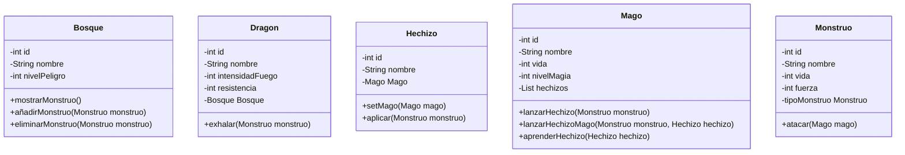
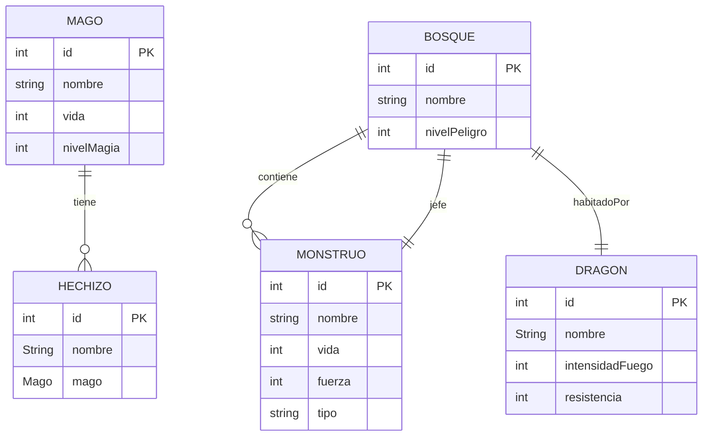
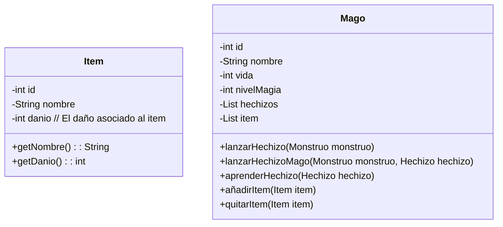
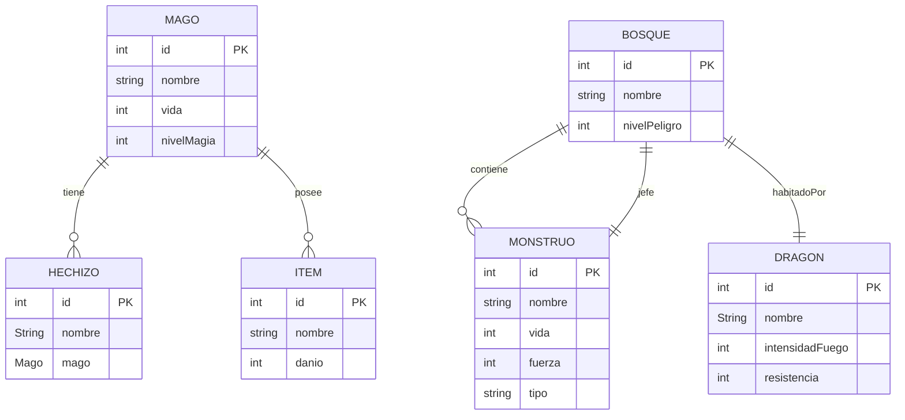

# Documentación del modelo de datos

## Introduccion
El ejercicio trata de realizar una aplicación de aventura medieval que usando MYSQL e Hibernate gestiona una base de datos dragolandia.

- Se definen unas clases principales tales como Bosque, Dragon, Hechizo, Mago y Monstruo.
- Se realizan las operaciones CRUD (creación, actualización, eliminación, búsqueda/consulta).
- Se realiza la lógica del juego basado en unos parámetros concretos.

## Analisis

### Diagrama de clases

## Diseño

### Diagrama Entidad-Relación (ER)

## Futuras Mejoras

### Descripción

Como futuras mejores veo que se podría añadir:

- Una lógica del juego que no está implementada ahora, que según aumente el nivel de peligro del bosque, aumente la fuerza y la vida de los enemigos. Además, también podemos introducir mucha más aleatoriedad haciendo que la aparición de enemigos se generen de forma random para que las partidas sean diferentes.
- Añadir una variable velocidad a los magos, dragones y enemigos para decidir quién ataca antes.
- Uso de interfaz gráfica ya que aquí lo saco todo por consola.
- Para modificar un pelín los diagramas, añado un objeto que es un ítem, que lo posee el mago. Ahora el mago hará daño según este ítem que tenga equipado. Será una lista de ítems, donde habría que programar la lógica para que se ataque con el que mayor fuerza tiene.

### Diagrama de clases
Meteríamos la clase Item y actualizaríamos Mago en el diagrama de clases

### Diagrama Entidad-Relación (ER)

Ahora añadimos al diagrama ER la entidad ítem, y la relacionamos 1:N con los Magos ya que 1 Mago puede tener N ítems

## Manual Usuario

Este es el manual de usuario del programa: [ManualUsuario](./manualUsuario.md)

## Pdf de ejecución

Este es el pdf de ejecución del programa: [PDFImagenes](AnxoBua_DragolandiaHibernate.pdf)
