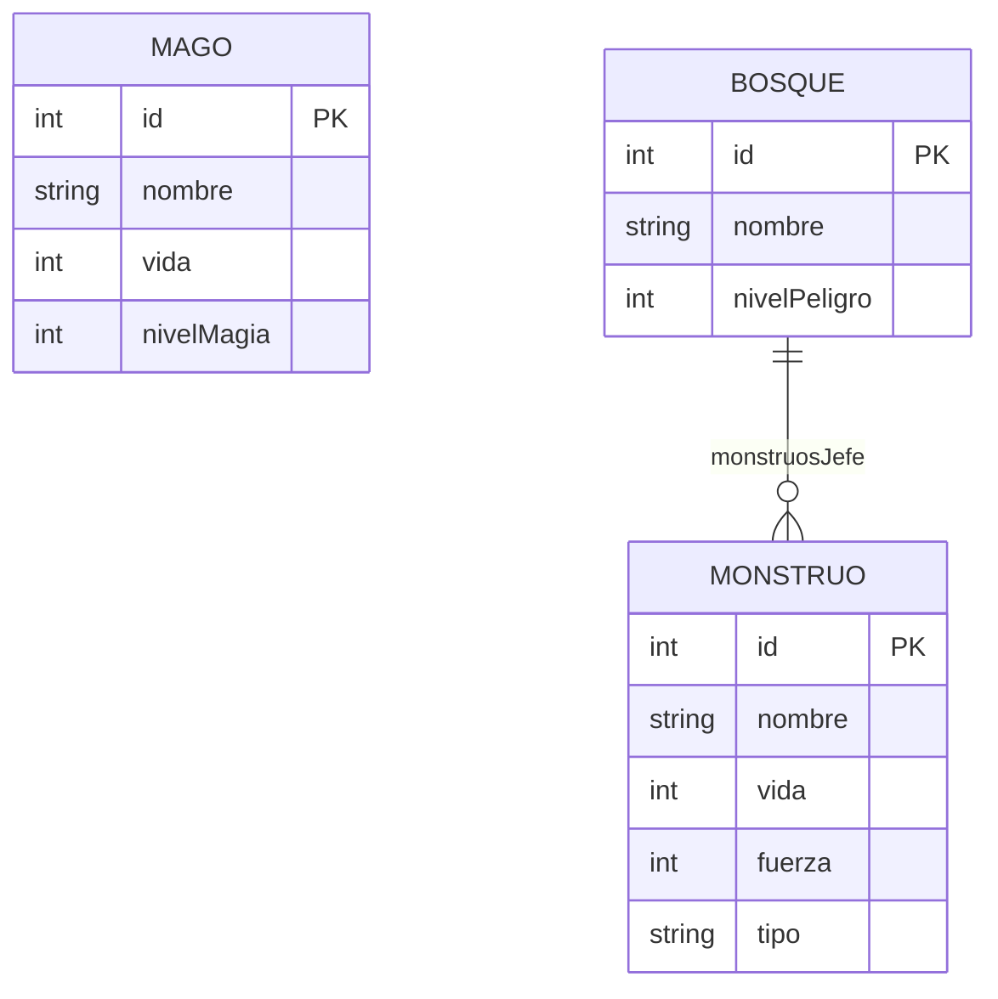

# Documentación del modelo de datos

## Diagrama Entidad-Relación (ER)

```mermaid
erDiagram

    MAGO {
        int id PK
        string nombre
        int vida
        int nivelMagia
    }

    MONSTRUO {
        int id PK
        string nombre
        int vida
        int fuerza
        string tipo
    }

    BOSQUE {
        int id PK
        string nombre
        int nivelPeligro
    }

    %% Relaciones
    BOSQUE ||--o{ MONSTRUO : "monstruosJefe"
```
